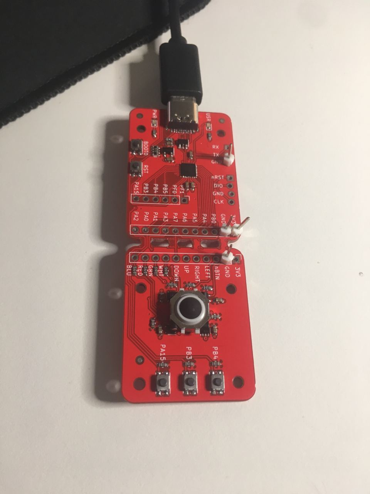

# :mouse: Blackberry rusty mouse

The purpose of this project is to build a [blackberry-trackball mouse][bb_trackball] and glue it to the middle of [an (allegedly) ergonomic keyboard][microsoft_natural_keyboard_4000]... **in Rust Embedded**, for the [STM32F042][stm32f042] :)

This came about [from twitter idea to board, then to Rust Embedded](https://twitter.com/braincode/status/1275406584714104833). The code is based on [RTIC][rtic] rust-embedded framework (formerly known as RTFM). It exclusively uses interrupts *and* [also works on OSX, not only Linux][osx_not_working] (wink wink, nudge nudge, [James][jamesmunns] ;P).

## :rocket: Future improvements shall you take this code with you

* DPI tweaking to have a better trackball accuracy or speed/stepping.
* [Button debouncer][debouncer].
* Remove one of the buttons of the <acronym title="Printed Circuit Board">PCB</acronym>, since it conflicts with one of the trackball GPIOs... oops, hardware blopper ;)
* Add acceleration [like @LSChyi did][add_accel]?
* Perhaps a clever (optical) system to make this experiment actually practical and useful :P
* On OSX the mouse works fine. **On GNU/Linux systems, the mouse might stop responding after ~30 seconds of use**. [This could be related to the Linux USB autosuspend subsystem.](https://askubuntu.com/questions/185274/how-can-i-disable-usb-autosuspend-for-a-specific-device). Try to fix that from the firmware so that it works everywhere?
* If enough people show interest and [**choose to sponsor me**][gh_sponsor_1], I would love to look at how to:
	1. Understand the flash process of the [Beken 3231][beken3231].
	2. Implement an LLVM backend for the [ARM968E-S][ARM968E-S] and have `rustc` working with it.
	3. Goal: **have a sub-$1 bluetooth IC that potentially does all we need and more** plus learn to [implement an LLVM backend from scratch][llvm_cpu0]. Also provide [**a way to upcycle bluetooth hardware, keeping it away from the dumpster.**][old_beken_hardware]
* ~~[Write a simplified RTIC example to return the favour to that amazing rust-embedded community][rtic_hid_example]~~: [Done][rtic_pr].

## :clap: Special thanks to

[@joshajohnson][joshajohnson]
[@mvirkkunen][lumpio]
[@therealprof][therealprof]
[@jamesmunns][jamesmunns]
[@TeXitoi][texitoi]
[@TheZoq2][thezoq2]

And all the folks from the [RTIC matrix.org community][rtic_matrix] for patiently guiding and helping me in this experiment.

[bb_trackball]: https://os.mbed.com/users/AdamGreen/notebook/blackberrytrackballmouse/
[joshajohnson]: https://github.com/joshajohnson
[lumpio]: https://github.com/mvirkkunen/
[therealprof]: https://github.com/therealprof/
[rtic]: https://rtic.rs/
[jamesmunns]: https://github.com/jamesmunns
[osx_not_working]: https://github.com/jamesmunns/OtterPill-rs/commit/8e68fbd5bb1161d8131a99d98c90c3e949f49ec1
[rtic_hid_example]: https://github.com/rtic-rs/rtic-examples/issues/10#issuecomment-677464683
[add_accel]: https://github.com/LSChyi/blackberry-mini-trackball
[debouncer]: https://crates.io/crates/unflappable
[microsoft_natural_keyboard_4000]: https://www.microsoft.com/accessories/en-us/products/keyboards/natural-ergonomic-keyboard-4000/b2m-00012
[stm32f042]: https://www.st.com/en/microcontrollers-microprocessors/stm32f0-series.html
[rtic_pr]: https://github.com/rtic-rs/rtic-examples/pull/12
[gh_sponsor_1]: https://github.com/login?return_to=%2Fsponsors%2Fbrainstorm%2Fsponsorships%3Ftier_id%3D27561
[mitxela]: https://mitxela.com/forum/topic/beken-bk3231
[ARM968E-S]: https://static.docs.arm.com/ddi0311/d/DDI0311.pdf
[beken3231]: https://pdfhost.io/v/3r1I3HggE_BK3231_Bluetooth_HID_SoCpdf.pdf
[llvm_cpu0]: http://jonathan2251.github.io/lbd/TutorialLLVMBackendCpu0.pdf
[texitoi]: https://github.com/TeXitoi
[thezoq2]: https://gitlab.com/TheZoq2/hotas
[old_beken_hardware]: https://mitxela.com/forum/topic/mocute-051-bluetooth-gamepad-bk3231-change-hid-profile-from-keyboard-gamepad
[rtic_matrix]: https://matrix.to/#/#rtic:matrix.org
