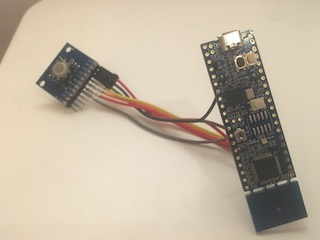

# Rust example for LPC845-BRK and BlackBerry trackball

This is a small example program, written in the Rust programming language, for the LCP845-BRK. 

It lights the RGB LED on the LPC board if the user button is pressed and/or any of the hall sensors on the trackball breakout board are triggered. It is based on [LPC8xx HAL](https://github.com/lpc-rs/lpc8xx-hal) and [LPC845-example](https://github.com/braun-embedded/lpc845-example) repos from [@braun-embedded](https://github.com/braun-embedded).



You can flash the board using [*cargo-flash*](https://crates.io/crates/cargo-flash):

```shell
$ cargo flash --chip=LPC845M301JBD48
    Finished dev [unoptimized + debuginfo] target(s) in 0.02s
    Flashing /Users/romanvg/dev/cchs/keyboard_trackball/software/lpc845-example/target/thumbv6m-none-eabi/debug/lpc845
     Erasing sectors ✔ [00:00:01] [############################]   9.00KB/  9.00KB @   5.77KB/s (eta 0s )
 Programming pages   ✔ [00:00:02] [############################]   9.00KB/  9.00KB @   2.36KB/s (eta 0s )
```

No need for OpenOCD :)
